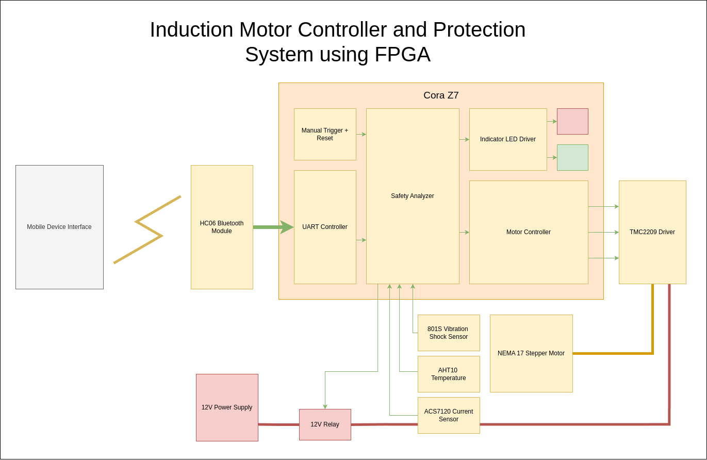

# 🎛️ FPGA Motor Controller

> FPGA Based Automated TMC2209 Motor Controller

---

*💸 Please consider donating on [Paypal](https://www.paypal.com/donate/?hosted_button_id=4EWXTWQ9FUFLA) to keep this project alive.*

Will be updated...

## 🎯 Objectives

Will be updated...

## 🏗️ Architecture

> 
> The architecture of the hardware

## 💽 Components

Will be updated...

## 🎢 Limitations

Will be updated...

## 🛠️ Further Improvements

Will be updated...

## 📊 Demonstration

` © 2024, Asanka Sovis`

